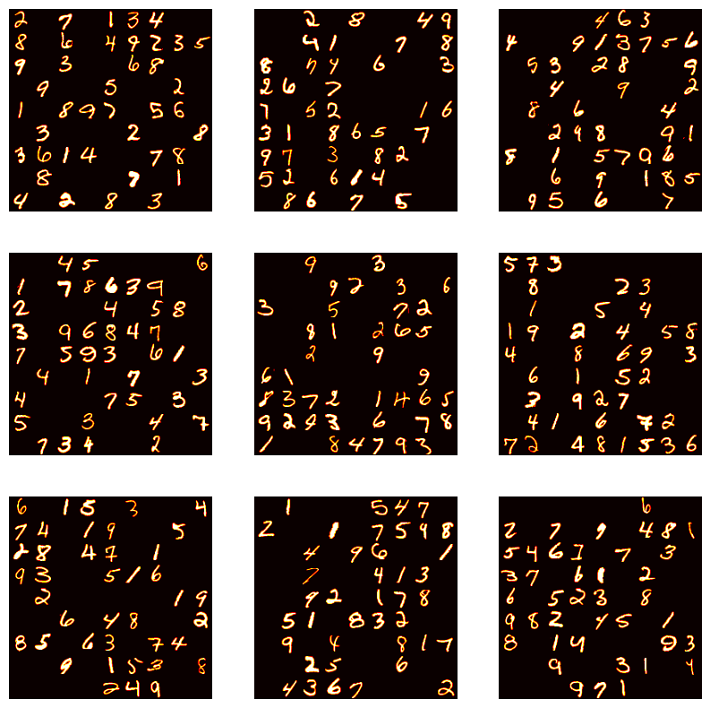
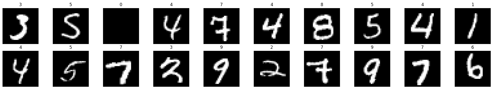
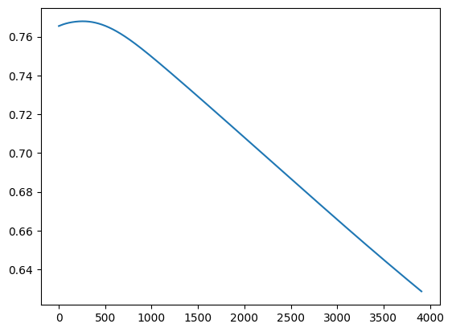
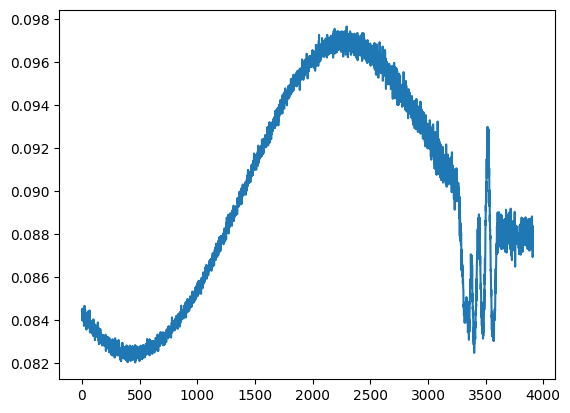
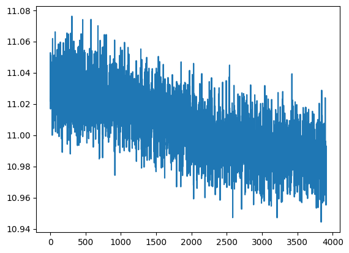

# Neural Sudoku Solver — From Handwritten Grids to Solutions

**Framework:** PyTorch  
**Environment:** Google Colab (GPU)

---

A two-stage neural pipeline that reads handwritten Sudoku puzzle images and predicts completed solutions. Stage 1 handles optical digit recognition; Stage 2 attempts to learn Sudoku-solving as a neural optimization problem with three different loss strategies compared.

## Stage 1 — Handwritten Digit Recognition

**Input:** 252×252 pixel images of handwritten Sudoku grids (9×9 cells, each 28×28 pixels)

<p align="center">
  
  <br><em>Sample handwritten Sudoku grids from the training dataset</em>
</p>

**Approach:**
- Train a Multi-Layer Perceptron on MNIST (784 → hidden → 10 classes)
- Slice each 252×252 Sudoku image into 81 individual 28×28 cells
- Classify each cell to extract the digit grid

<p align="center">
  
  <br><em>MNIST samples used for training the digit classifier</em>
</p>

**Result:** 100% test accuracy on MNIST digit classification, the digit reader works reliably.

## Stage 2 — Solving Sudoku with CNNs

Given an incomplete 9×9 numerical grid, predict the complete solution using a Convolutional Neural Network. Three loss functions were compared to understand which best captures Sudoku constraints:

### Custom Sudoku Loss

Encodes Sudoku rules directly: row sums, column sums, and 3×3 box sums must each equal 45. This is the most interesting approach — instead of generic regression, the loss function itself understands the problem structure.

<p align="center">
  
  <br><em>Custom Sudoku rules loss — smooth convergence, the model learns constraint structure</em>
</p>

### MSE Loss

Standard mean squared error — treats solving as pure regression without any Sudoku-specific knowledge.

<p align="center">
  
  <br><em>MSE loss — unstable training with overfitting pattern, loss increases mid-training before partially recovering</em>
</p>

### Cross-Entropy Loss

Treats each cell as a 9-class classification problem.

<p align="center">
  
  <br><em>Cross-Entropy loss — very noisy gradient signal, slow convergence, high variance throughout</em>
</p>

### Key Observations

The custom Sudoku loss clearly outperforms both generic alternatives. This makes sense: by encoding domain knowledge (the rules of Sudoku) directly into the loss function, the network receives a more informative gradient signal. MSE and Cross-Entropy treat this as a generic prediction problem and struggle because they have no awareness of the structural constraints.


## Architecture

```
SudokuSolverCNN(
  Conv2d(1, 64, kernel_size=3, padding=1)
  → BatchNorm → ReLU
  → Conv2d(64, 128, kernel_size=3, padding=1)
  → BatchNorm → ReLU
  → Fully connected layers
  → Output: 9×9 grid
)
```

**Optimizer:** Adam (lr=0.0001)  
**Dataset:** 50,000 training grids / 10,000 test grids  
**Training:** 10 epochs per loss variant

## Project Structure

| File | Purpose |
|------|---------|
| `ANN_Task1.ipynb` | MNIST MLP training + digit extraction from Sudoku images |
| `ANN_Task2_MSE.ipynb` | CNN solver with 3 loss function experiments + Kaggle submission |
| `ANN_Task2_sub_array.ipynb` | Preprocessing: converts raw images → 9×9 grids using Task 1 model |


## Technologies


